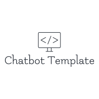

[![Contributors][contributors-shield]][contributors-url]
[![Forks][forks-shield]][forks-url]
[![Stargazers][stars-shield]][stars-url]
[![Issues][issues-shield]][issues-url]
[![MIT License][license-shield]][license-url]
[![LinkedIn][linkedin-shield]][linkedin-url]

<!-- PROJECT LOGO -->
<br />
<p style="text-align:center">
  <a href="https://github.com/kxylu/specter">
    
  </a>

  <h3 style="text-align:center">Specter: A Chatbot Template</h3>

  <p style="text-align:center">
    This project is the generic template of a fullstack chatbot.
    <br />
    <a href="https://github.com/kxylu/specter/wiki"><strong>Explore the docs »</strong></a>
    <br />
    <br />
    <a href="https://github.com/kxylu/specter">View Demo</a>
    ·
    <a href="https://github.com/kxylu/chatbot-template/issues">Report Bug</a>
    ·
    <a href="https://github.com/kxylu/chatbot-template/issues">Request Feature</a>
  </p>
</p>

<!-- TABLE OF CONTENTS -->
<details open="open">
  <summary><h2 style="display: inline-block">Table of Contents</h2></summary>
  <ol>
    <li>
      <a href="#about-the-project">About The Project</a>
      <ul>
        <li><a href="#built-with">Built With</a></li>
      </ul>
    </li>
    <li>
      <a href="#getting-started">Getting Started</a>
      <ul>
        <li><a href="#prerequisites">Prerequisites</a></li>
        <li><a href="#installation">Installation</a></li>
      </ul>
    </li>
    <li><a href="#usage">Usage</a></li>
    <li><a href="#roadmap">Roadmap</a></li>
    <li><a href="#license">License</a></li>
    <li><a href="#contact">Contact</a></li>
    <li><a href="#acknowledgements">Acknowledgements</a></li>
  </ol>
</details>

<!-- ABOUT THE PROJECT -->

## About The Project

<!-- TODO: Insert Image Here -->

### Built With

- [React JS](https://reactjs.org/)
- [Flask](https://flask.palletsprojects.com/en/1.1.x/)
- [Docker](https://www.docker.com/)
- [Postgres](https://www.postgresql.org/)

<!-- GETTING STARTED -->

## Getting Started

Clone the repo

```sh
git clone https://github.com/kxylu/specter.git
```

This project can be either locally or on a series of docker containers.
Please refer to this [link]() for details on how to install docker.

### Running on Docker

Run

```sh
docker-compose up -d --build
```

in project root.

### Running on Locally

<!-- TODO -->

## Usage

<!-- TODO -->

<!-- ROADMAP -->

## Roadmap

See the [open issues](https://github.com/kxylu/specter/issues) for a list of proposed features (and known issues).

<!-- CONTRIBUTING -->
<!-- TODO -->

<!-- LICENSE -->

## License

Distributed under the MIT License. See `LICENSE` for more information.

<!-- CONTACT -->

## Contact

Karen Lu - karenxylu@gmail.com

Project Link: [https://github.com/kxylu/specter](https://github.com/kxylu/specter)

<!-- ACKNOWLEDGEMENTS -->

## Acknowledgements

- [Github Best Templates](https://github.com/othneildrew/Best-README-Template)
- [flask-vue-kubernetes](https://github.com/testdrivenio/flask-vue-kubernetes)
- []()

[contributors-shield]: https://img.shields.io/github/contributors/kxylu/specter.svg?style=for-the-badge
[contributors-url]: https://github.com/kxylu/specter/graphs/contributors
[forks-shield]: https://img.shields.io/github/forks/kxylu/specter.svg?style=for-the-badge
[forks-url]: https://github.com/kxylu/specter/network/members
[stars-shield]: https://img.shields.io/github/stars/kxylu/specter.svg?style=for-the-badge
[stars-url]: https://github.com/kxylu/specter/stargazers
[issues-shield]: https://img.shields.io/github/issues/kxylu/specter.svg?style=for-the-badge
[issues-url]: https://github.com/kxylu/specter/issues
[license-shield]: https://img.shields.io/github/license/kxylu/specter.svg?style=for-the-badge
[license-url]: https://github.com/kxylu/specter/blob/main/LICENSE.txt
[linkedin-shield]: https://img.shields.io/badge/-LinkedIn-black.svg?style=for-the-badge&logo=linkedin&colorB=555
[linkedin-url]: https://www.linkedin.com/in/lutetiumx/
